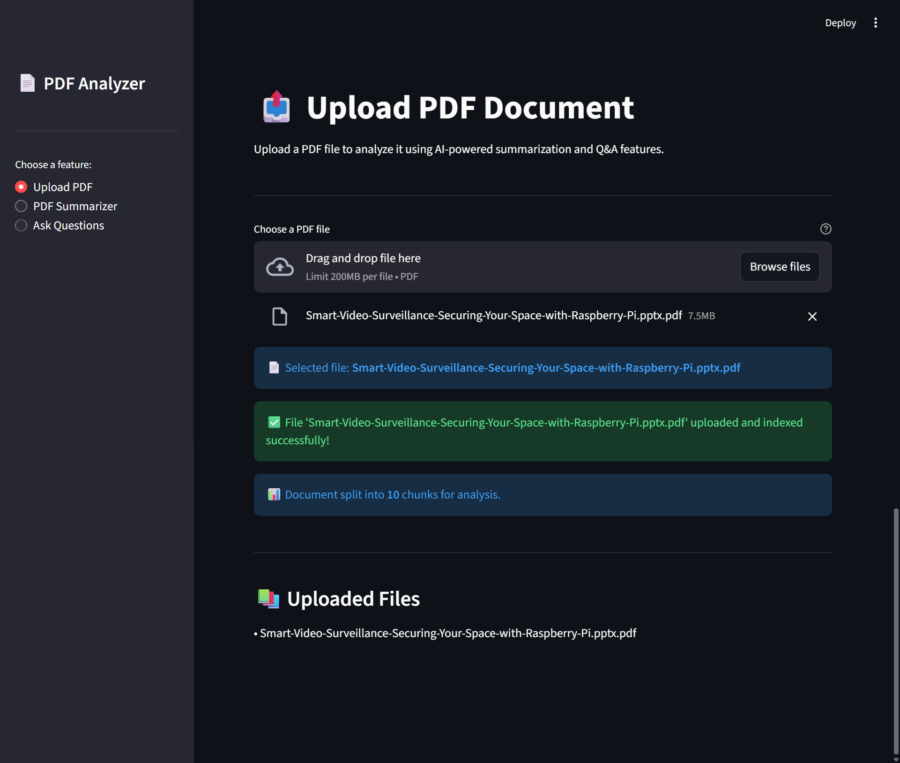
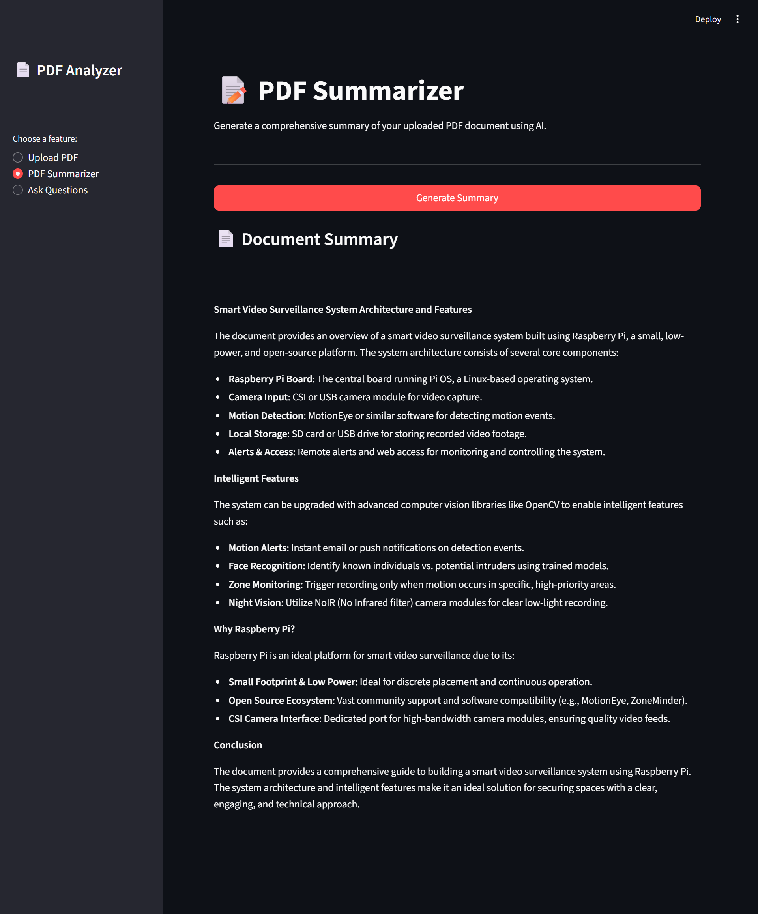
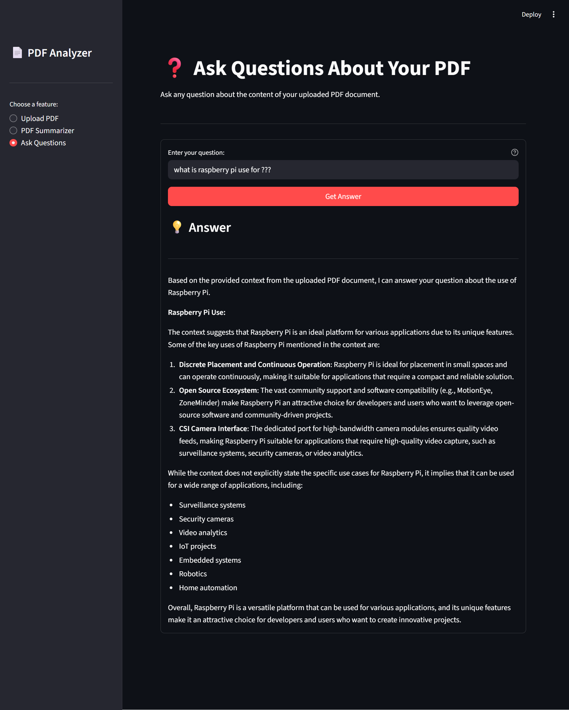

# 📄 PDF Analyzer RAG Application

<div align="center">


**An intelligent PDF analysis tool powered by RAG (Retrieval-Augmented Generation) that enables document summarization and question-answering using advanced AI models.**

[Features](#-features) • [Installation](#-installation) • [Usage](#-usage) • [Architecture](#-architecture) • [Tech Stack](#-tech-stack)

</div>

---

## 🌟 Overview

PDF Analyzer RAG Application is a powerful web application that leverages **Retrieval-Augmented Generation (RAG)** technology to analyze PDF documents. Built with Streamlit and LangChain, it provides two main capabilities:

1. **📝 PDF Summarization** - Generate comprehensive, AI-powered summaries of uploaded PDF documents
2. **❓ Question-Answering** - Ask questions about your PDF content and get accurate answers based on the document

The application uses vector embeddings and semantic search to retrieve relevant information from documents, then employs Large Language Models (LLMs) to generate intelligent responses.

---

## 📸 Screenshots

### Upload PDF


### PDF Summarizer


### Ask Questions


---

## ✨ Features

- 📤 **Easy PDF Upload** - Simple drag-and-drop interface for uploading PDF documents
- 🔍 **Intelligent Document Indexing** - Automatic chunking and vector embedding of PDF content
- 📊 **AI-Powered Summarization** - Generate comprehensive summaries using advanced LLM models
- 💬 **Interactive Q&A** - Ask questions and get accurate answers based on document content
- 🚀 **Fast & Efficient** - Powered by Groq's high-performance LLM inference
- 🎨 **User-Friendly Interface** - Clean, intuitive Streamlit-based web interface
- 💾 **Persistent Storage** - Vector database persists across sessions using ChromaDB

---

## 🏗️ Architecture

```
┌─────────────────────────────────────────────────────────────┐
│                    Streamlit Web Interface                   │
│  ┌──────────────┐  ┌──────────────┐  ┌──────────────┐      │
│  │ Upload PDF   │  │  Summarizer  │  │ Ask Questions│      │
│  └──────┬───────┘  └──────┬───────┘  └──────┬───────┘      │
└─────────┼──────────────────┼──────────────────┼─────────────┘
          │                  │                  │
          ▼                  ▼                  ▼
┌─────────────────────────────────────────────────────────────┐
│                    LangChain Chains                          │
│  ┌──────────────────────────────────────────────────────┐   │
│  │  PDF Processing → Chunking → Embedding → Storage     │   │
│  └──────────────────────────────────────────────────────┘   │
└─────────┬────────────────────────────────────────────────────┘
          │
          ▼
┌─────────────────────────────────────────────────────────────┐
│                    ChromaDB Vector Store                     │
│              (Persistent Document Embeddings)                │
└─────────┬────────────────────────────────────────────────────┘
          │
          ▼
┌─────────────────────────────────────────────────────────────┐
│                    RAG Pipeline                              │
│  ┌──────────────┐      ┌──────────────┐      ┌──────────┐  │
│  │  Retrieval   │ ───► │   Context    │ ───► │   LLM    │  │
│  │  (Semantic)  │      │  Augmentation│      │ (Groq)   │  │
│  └──────────────┘      └──────────────┘      └──────────┘  │
└─────────────────────────────────────────────────────────────┘
```

---

## 🛠️ Tech Stack

### Core Technologies
- **Python 3.11.0** - Programming language
- **Streamlit** - Web application framework
- **LangChain** - LLM application framework
- **ChromaDB** - Vector database for embeddings

### AI/ML Libraries
- **LangChain Groq** - High-performance LLM inference
- **LangChain HuggingFace** - Embedding models
- **Sentence Transformers** - Text embeddings
- **PyPDF** - PDF document processing

### Additional Libraries
- **python-dotenv** - Environment variable management
- **LangChain Community** - Community integrations
- **LangChain Text Splitters** - Document chunking

---

## 📋 Prerequisites

Before you begin, ensure you have the following installed:

- **Python 3.11.0** or higher
- **pip** (Python package manager)
- **Git** (for cloning the repository)

### API Keys Required

You'll need the following API keys (get them from respective providers):

- **Groq API Key** - For LLM inference ([Get it here](https://console.groq.com/))
- **HuggingFace API Key** (Optional) - For HuggingFace models ([Get it here](https://huggingface.co/settings/tokens))

---

## 🚀 Installation

### 1. Clone the Repository

```bash
git clone https://github.com/yourusername/pdf-analyzer-rag-application.git
cd pdf-analyzer-rag-application
```

### 2. Create Virtual Environment

```bash
# On Windows
python -m venv venv
venv\Scripts\activate

# On macOS/Linux
python3 -m venv venv
source venv/bin/activate
```

### 3. Install Dependencies

```bash
pip install -r requirements.txt
```

### 4. Set Up Environment Variables

Create a `.env` file in the root directory:

```env
# Required
GROQ_API_KEY=your_groq_api_key_here

# Optional (for HuggingFace models)
HUGGINGFACE_API_KEY=your_huggingface_api_key_here
```

### 5. Run the Application

```bash
streamlit run app.py
```

The application will open in your default web browser at `http://localhost:8501`

---

## 📖 Usage

### Step 1: Upload PDF Document


1. Navigate to the **"Upload PDF"** section in the sidebar
2. Click on the file uploader or drag and drop your PDF file
3. Wait for the document to be processed and indexed
4. You'll see a success message with the number of chunks created

### Step 2: Generate Summary


1. Go to the **"PDF Summarizer"** section
2. Click the **"Generate Summary"** button
3. The AI will analyze your document and generate a comprehensive summary
4. The summary will appear below the button

### Step 3: Ask Questions


1. Navigate to the **"Ask Questions"** section
2. Enter your question in the text input field
3. Click **"Get Answer"** button
4. The application will search through your PDF and provide an accurate answer

### Example Questions

- "What are the main topics discussed in this document?"
- "Summarize the key findings"
- "What methodology was used?"
- "List all the important dates mentioned"
- "What are the conclusions?"

---

## 📁 Project Structure

```
pdf-analyzer-rag-application/
│
├── app.py                 # Main Streamlit application
├── chains.py              # LangChain chains for summarization and Q&A
├── models.py              # LLM and embedding model configurations
├── prompts.py             # Prompt templates for LLM interactions
├── vectordb_config.py     # Vector database setup and PDF processing
├── requirements.txt       # Python dependencies
├── .env                   # Environment variables (create this)
├── .gitignore            # Git ignore file
├── README.md             # Project documentation
├── LICENSE               # MIT License file
│
├── ui_images/            # Application screenshots
│   ├── Upload.png        # Upload PDF interface screenshot
│   ├── summary.png       # PDF Summarizer interface screenshot
│   └── QnA.png          # Ask Questions interface screenshot
│
├── chroma_db/            # ChromaDB persistent storage (auto-created)
├── data_source/          # Temporary PDF storage (auto-created)
└── venv/                 # Virtual environment (not in git)
```

---

## 🔧 Configuration

### Model Configuration

You can customize the models in `models.py`:

- **LLM Model**: Currently using Groq's `llama-3.1-8b-instant`
- **Embedding Model**: Using `sentence-transformers/all-MiniLM-L6-v2`

### Chunking Configuration

In `vectordb_config.py`, you can adjust:

- **Chunk Size**: Default is 1000 characters
- **Chunk Overlap**: Default is 200 characters

### Retrieval Configuration

In `chains.py`, you can modify:

- **Summary Chunks**: Default is 20 chunks for summarization
- **Q&A Chunks**: Default is 5 chunks for question-answering

---

## 🎯 How It Works

### 1. Document Processing
- PDF is uploaded and loaded using PyPDFLoader
- Document is split into smaller chunks (1000 chars with 200 overlap)
- Each chunk is converted to vector embeddings using HuggingFace embeddings

### 2. Vector Storage
- Embeddings are stored in ChromaDB vector database
- Database persists locally in `./chroma_db` directory
- Enables fast semantic search across document content

### 3. Retrieval-Augmented Generation (RAG)
- **For Summarization**: Retrieves top 20 relevant chunks
- **For Q&A**: Retrieves top 5 chunks most relevant to the question
- Retrieved chunks are combined into context

### 4. LLM Generation
- Context is passed to Groq LLM (Llama 3.1 8B)
- LLM generates summary or answer based on the context
- Response is returned to the user

---

## 🐛 Troubleshooting

### Common Issues

**Issue**: `ModuleNotFoundError` when running the app
- **Solution**: Ensure virtual environment is activated and all dependencies are installed

**Issue**: API key errors
- **Solution**: Verify your `.env` file exists and contains valid API keys

**Issue**: PDF upload fails
- **Solution**: Ensure the PDF file is not corrupted and is a valid PDF format

**Issue**: No documents found error
- **Solution**: Make sure you've uploaded a PDF before trying to summarize or ask questions

**Issue**: ChromaDB errors
- **Solution**: Delete the `chroma_db` folder and restart the application

---

## 🤝 Contributing

Contributions are welcome! Please feel free to submit a Pull Request. For major changes, please open an issue first to discuss what you would like to change.

1. Fork the repository
2. Create your feature branch (`git checkout -b feature/AmazingFeature`)
3. Commit your changes (`git commit -m 'Add some AmazingFeature'`)
4. Push to the branch (`git push origin feature/AmazingFeature`)
5. Open a Pull Request

---

## 📝 License

This project is licensed under the MIT License - see the LICENSE file for details.

---

## 👤 Author

**Your Name**
- GitHub: [@yourusername](https://github.com/yourusername)
- Email: your.email@example.com

---

## 🙏 Acknowledgments

- [LangChain](https://www.langchain.com/) for the amazing LLM framework
- [Streamlit](https://streamlit.io/) for the web framework
- [Groq](https://groq.com/) for high-performance LLM inference
- [ChromaDB](https://www.trychroma.com/) for vector database
- [HuggingFace](https://huggingface.co/) for embedding models

---

## 📊 Future Enhancements

- [ ] Support for multiple PDF formats (DOCX, TXT, etc.)
- [ ] Batch PDF processing
- [ ] Export summaries to different formats
- [ ] Chat history for Q&A sessions
- [ ] User authentication and document management
- [ ] Advanced search filters
- [ ] Custom model selection
- [ ] API endpoint for programmatic access

---

<div align="center">

**⭐ If you find this project helpful, please give it a star! ⭐**

Made with ❤️ using Python and Streamlit

</div>
